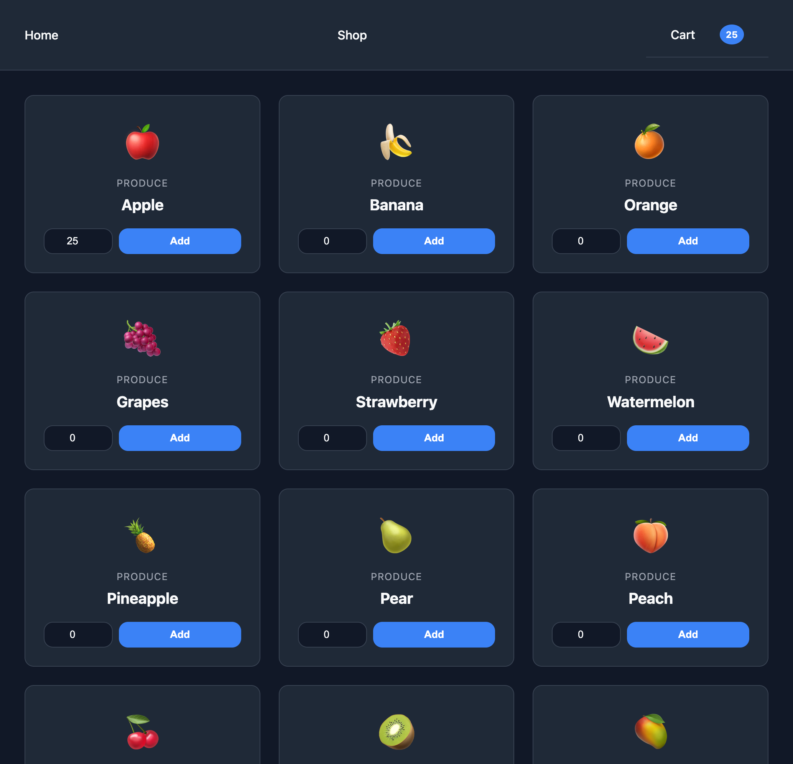
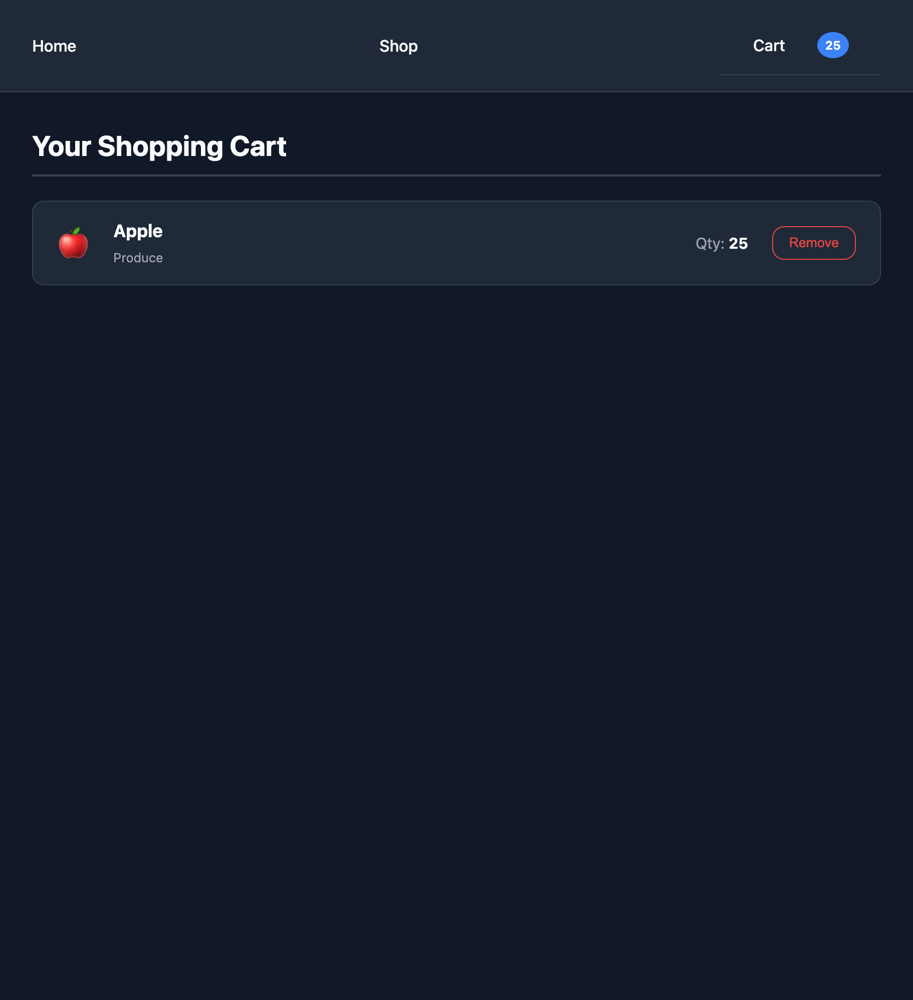

# Shopping Cart

**A shopping cart built with React and React Router.**

## Visual Demonstration

| Shop                               | Cart                                      |
| :--------------------------------- | :---------------------------------------- |
|  |  |

## Key Features

- **Global State Management**
- **Dynamic Cart Logic**
- **Live Cart Badge**

## How to Run This Locally

1. Clone the repository to your local machine.
2. Navigate into the project directory.
3. Install dependencies: in your terminal, enter `npm install`.
4. Launch the local development server: in your terminal, enter `npm run dev`.
5. Navigate to the `localhost` URL provided in your terminal output.
